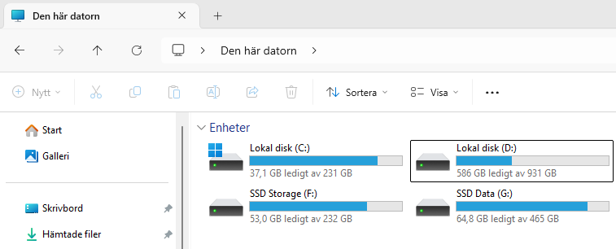

Att hantera filer är ett en typ av IO-process som ofta är nödvändig för en utvecklare. I vissa fall så är det att man vill ha kvar sin data efter programmet stängs av, så att man kan återställa det man arbetat med. Exempel på sådana program är Google Docs, Visual Studio, Unity men även spel behöver också både skriva och läsa från filer. 

## I/O processer
Mycket man gör vid utveckling av mjukvara är att man tar antingen emot input (data in) eller så ger man en output (data ut). IO i sig självt behöver inte innebära att det är den lokala användaren som direkt ser resultatet, utan det kan också vara en sak som inte syns utåt.

Kommunikation mellan enheter (exempelvis två datorer i ett nätverk) kräver ocskå att man både skickar och tar emot data. Analoga detaljer är också en typ av IO-process. Att hantera muspekare och tangentbord är en IO-process, men att skriva ut på en skrivare är också en output.

I C# så har du förmodligen kommit i kontakt med konsolfönstret/terminalen. Detta är en metod för användarinput och även att ge output till användaren.

## Operativsystem (OS)
Operativsystem är ofta nycklen för de olika processerna som är tillgängliga och även möjliggör en att kommunicera med olika typer av IO-processer.

Det är även denna resurs som lägger ett visst ansvar på utvecklaren, när man tar in en resurs som är "utanför" programmet så kan man se det som att man "öppnar en dörr" och att man måste stänga denna dörr efteråt. När vi ber OS om att öppna en fil så måste vi följa vissa regler för att det ska gå rätt till.

Men det är OS som är ytterst ansvarigt när det kommer till filer, och det är även det som bestämmer ifall vi får lov att skapa, öppna eller skriva en fil på en viss plats. Till hjälp för detta har OS ett filsystem som hjälper till med att organisera dessa filer på något vis, oftast genom att skapa en trädstruktur där man har "mappar" som förvarar antingen ytterligare en mapp eller så har den filer.

Nedan är ett exempel från Windows 11 om hur det potentiellt kan se ut.

Därför är processen att öppna en fil annorlunda beroende på ens OS, eftersom Windows har sin egen struktur med enhetsbeteckningar som `C:`, `D:` och så vidare. I Linux så är grundkatalogerna istället som `/home/användare/`, `/etc` och liknande. Högnivås-programmeringsspråk har med den anledningen oftast ett helomslutande system för att hantera dessa strukturer, men det är något man måste kolla upp hur man går tillväga för det enskilda språket. Att förlita sig på att det fungerar likadant skapar alltså problem. 

## Sammanfattning
Att hantera I/O är mångsidigt, och vissa av dessa kan vara mus/tangentbord, andra kan vara skrivare, nätverkskommunikation eller filer. Att öppna och läsa en fil är mer beroende på Operativsystemet och det underliggande filsystemet som används för att hålla koll på alla filer man har på datorn.