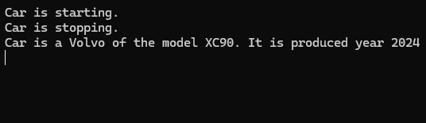

## Paradigmer
Olika programmeringsspråk erbjuder olika lösningar för problem man kan stöta på som utvecklare. Dessa olika lösningar kallas för "programmeringsparadigmer", man kan med lite annan formulering kalla det för programmeringsmetoder.

Man tänker alltså på ett systematiskt vis omkring all sin programkod ungefär på samma vis. C# fokuserar på en typ av paradigm; Objektorientering.

Andra möjliga varianter finns, och de har alla olika fördelar och nackdelar. Olika språk har olika stark koppling till dessa. 
Några exempel på andra paradigmer:
- Modulär programmering
- Proceduell programmering
- Strukturerad programmering
- Logikprogrammering
- Funktionell programmering
- Objektorienterad programmering

## Objektorienterad programmering
C# är i grund och botten helt orienterat omkring en paradigm som kallas för "Objektorienterad programmering". Det innebär att all kod struktureras som objekt, och dessa objekt interagerar med varandra. Ett av syftena med en sådan stil är att göra den mindre abstrakt, och därav göra det lättare att strukturera sina instruktioner.

Objekt har olika beståndsdelar, likt de man skulle koppla till objekt som man kan se.
Som exempel kommer en bil att beskrivas.

### Egenskaper (attribut)
Man beskriver vilka egenskaper bilen har, som utvecklare väljer man själv omfattningen på informationen som är relevant. I detta exempel så identifieras tre olika egenskaper:
- Märke - Beskriver vilket företag som tillverkar bilen
- Modell - Beskriver vilken typ av bil av företaget
- År - Beskriver året som bilen tillverkades

Med dessa tre egenskaper (de kallas för attribut) hjälper oss då att kunna skapa flera olika typer av bilar med olika märken, modeller och årgångar.

Precis som när man vanligtvis skapar en variabel i **statiskt typade** språk måste man beskriva vilken datatyp dessa attributen har. I bilexemplet så förvarar vi detta som två texter och ett datum.
```csharp
string make;
string model;
DateTime productionYear;
```
Något liknande såhär skulle då våra variabler se ut i vårt objekt "Bil".
### Beteenden
Objekt i vår omvärld har också funktionalitet, en person kan prata, en dörr går att låsa och även bilar har funktionalitet. Dessa kallar man för beteenden, och i objektorienterat språk kallar man detta för **medlemsmetoder**, vilket är en vanlig metod men bundet till ett objekt och alla dess egenskaper och attribut.

I exemplet av en bil så kommer denna bilen kunna startas och stoppas. Precis som när man skapar vanliga metoder så har de namn, en datatyp som resultat och kan också ta emot parametrar för att kunna köra.
```csharp
void Start() 
{
    Console.WriteLine("Car is started");
}

void Stop() 
{
    Console.WriteLine("Car is stopped");
}
```
Koden ovan är två vanliga metoder som bara skriver att bilen har startat och stoppat. Ifall man vill använda de andra attributen så fungerar det lika bra.
```csharp
string InspectCar()
{
    return "Car is a " + make + " of the model " + model + ". It is produced year " + productionYear.ToString("yyyy");
}
```
Koden ovan tillverkar då en string som sedan skickas tillbaka till var man anropade metoden, och då formaterad med de attributen som man gett bilen.

### Definiera objektet
Än så länge har det bara beskrivits *vad* ett objekt kan innehålla. För att faktiskt kunna skapa ett objekt så behöver man skapa en förklarning vad objektet ska innehålla, och vad denna *typ* av objekt ska kallas. Man skapar alltså en egen *typ*.

Klassifiera kallas det man gör i ett sådant fall, och reflekteras i språket med nyckelordet **class**. Komplett kod för objektet bil som diskuterades tidigare blir som följande:
```csharp
class Car
{
    public string make;
    public string model;
    public DateTime productionYear;

    public void Start() 
    {
        Console.WriteLine("Car is started.");
    }

    public void Stop()
    {
        Console.WriteLine("Car is stopped.");
    }

    public string Inspect()
    {
        return "Car is a " + make + " of the model " + model + ". It is produced year " + productionYear.ToString("yyyy");
    }
}
```

#### Nedbrytning av termerna
```csharp
class Bil { }
```
Detta berättar för datorn att man vill göra en ny objekttyp, och att den ska kallas för bil. Allting som läggs inom kodblocket `{ }` blir då antingen en egenskap eller ett beteende för detta objekt. 

Det är alltså beskrivningen *av vad en bil är och vad den kan göra* och inte ett faktiskt objekt än.

---
```csharp
public string make;
public string model;
public DateTime productionYear;
```
Detta berättar för datorn att typen `Car` har tre stycken attribut. Nyckelordet `public` framför själva typen för attributet är **synligheten** av attributet. `public` innebär då att den är synlig för alla som kan komma åt objektet.

---
```csharp
public void Start() 
{
    Console.WriteLine("Car is started.");
}

public void Stop()
{
    Console.WriteLine("Car is stopped.");
}

public string Inspect()
{
    return "Car is a " + make + " of the model " +  model + ". It is produced year " + productionYear.ToString("yyyy");
}
```
Detta är tre olika metoder som bilen har, och man kan köra. De kan använda sig av attributen men behöver inte göra det. Likt attributen har också metoderna en synlighet, `public` innebär att alla kan komma åt och köra metoderna.

### Skapa ett objekt av en typ
När man har skapat definitionen av ett objekt, och samtliga attribut och egenskaper så kan man skapa en **instans** av typen. Det är då ett "fysiskt" objekt som man kan fylla på med information eller köra metoderna. I ens kod skapar man ett objekt på följande vis.
```csharp
Car vehicle = new Car();
```
Som när man skapar en variabel av exempelvis `string`, `int` eller `double` så skriver man alltid enligt syntax <span style="color:#007ACC">datatyp</span> <span style="color:#9CDCFE">variabelnamn</span>;

På samma vis när man har skapat sin egen typ gör man som med alla andra typer av variabler man skapar.

## Kom åt attributen av en typ
När man har skapat ett objekt så kan man också komma åt attributen av typen. Det gör man genom att använda sin variabel som är av typen. 
```csharp
Car vehicle = new Car();

vehicle.make = "Volvo";
vehicle.model = "XC90";
vehicle.productionYear = new DateTime(2024);
```
Nu skapas en variabel av den egenskapade typen `Car`. Denna typen har då alla attributen, vi kan komma åt dem och assignera dem. Så fort vi skickar vidare denna variabel så kommer alla attributen med. Samma gäller egenskaperna som finns i typen.
```csharp
Car vehicle = new Car();

vehicle.make = "Volvo";
vehicle.model = "XC90";
vehicle.productionYear = new DateTime(2024);

vehicle.Start();
vehicle.Stop();

Console.WriteLine(vehicle.Inspect());
```
Förväntad utdata kan du se i bilden nedan.


